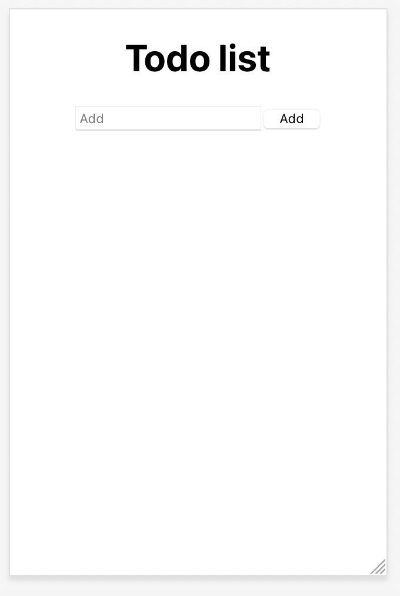
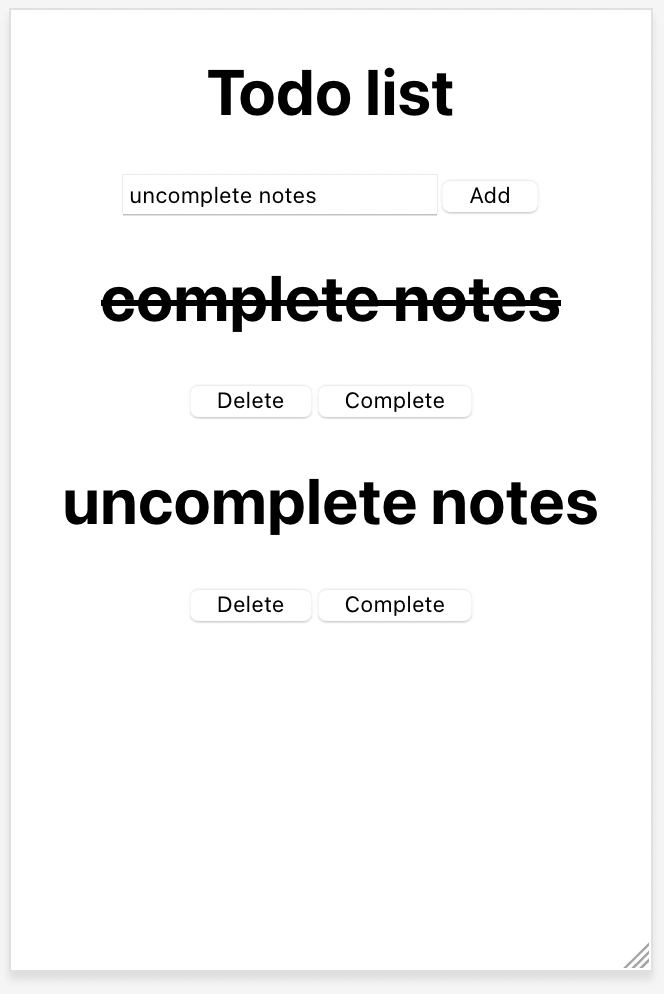

Todo List Application using reactJS

---

Just link your firebase console and paste the configuration for web to folder utils and create firebase.js file,and you should good to go!

---

Screenshot

